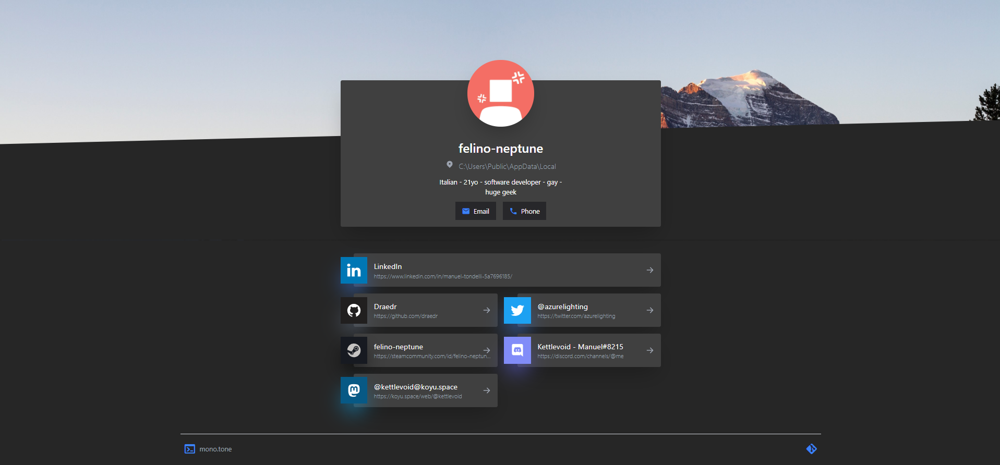

# mono.tone 
**mono.tone** is a self-hostable clone of solo.to! 

Create with the [Eleventy](https://www.11ty.dev) as the static site generator, [Tailwind CSS](https://tailwindcss.com) for the style and prepared for use with the [Forestry.io](https://forestry.io) headless CMS!

# Deploy mono.tone

To deploy mono.tone, you just need to fork it and deploy it on any serverless host, like [Netlify](https://www.netlify.com) or [Vercel](https://vercel.com)!
Or you can just press the green "Deploy" button down here to directly deploy to netlify!

# Manage mono.tone
You can manage your mono.tone page with Forestry.io! To do so, you just have to:

1. Go to [Forestry.io](https://forestry.io)
2. Click on "Import your Site Now" and select your fork of mono.tone! (In case you used the deploy button, it's the one created there)
3. Select "Config" in the sidebar and change your mono.tone settings! 

## Get a better URL on Netlify
---
To have your username (or really anything) as a URL on netlify, you just need to:
1. Go to your site on netlify's dashboard
2. Click on "Domain Settings"
3. Next to your domain name, press "Options" and then "Edit"

# To-Do
- Add custom classes to all elements for easier customizing with css
- Better contacts display when multiple
- Allow custom svg inside contacts OR move to fontawesome
- Re-create preset system
- Write docs for who isn't using forestry and for custom classes
